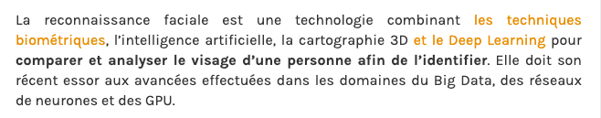
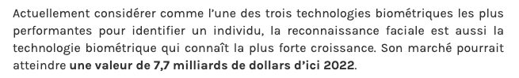

##### [Retour à l'acceuil](index.md) 

# Définition

| CNIL. "Reconnaissance faciale"[en ligne]. *CNIL*. [s. d.][Consulté le 6 juin 2020]. Disponible sur le Web : <https://www.cnil.fr/fr/definition/reconnaissance-faciale> |

| L, Bastien. "Reconnaissance faciale : qu’est-ce que c’est et quels sont les dangers ?" [en ligne] *LeBigData*. 23 octobre 2019. [Consulté le 6 juin 2020]. Disponible sur le Web : <https://www.lebigdata.fr/reconnaissance-faciale-tout-savoir> |
