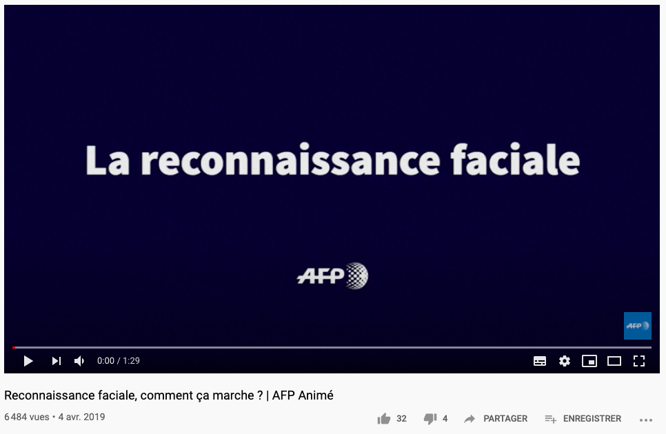
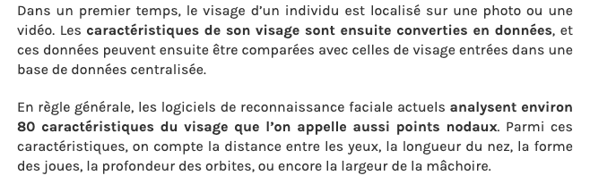
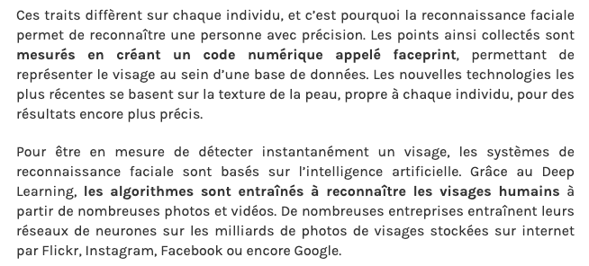
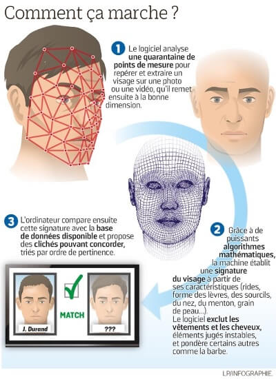

##### [Retour à l'acceuil](index.md) 

# Comment ça fonctionne? 

| AFP Animé. "Reconnaissance faciale, comment ça marche ?"[en ligne]. In YouTube. 4 avril 2019 [consulté le 14 juin 2020]. 1 min 29 secondes. Disponible sur le web : <https://www.youtube.com/watch?v=189Y7u6moT8> |

| L, Bastien. "Reconnaissance faciale : qu’est-ce que c’est et quels sont les dangers ?" [en ligne] *LeBigData*. 23 octobre 2019. [Consulté le 06 juin 2020]. Disponible sur le Web : <https://www.lebigdata.fr/reconnaissance-faciale-tout-savoir> |

|LAUNAY, Catherine. "Reconnaissance faciale : l’ Europe envisage son interdiction en public."[en ligne]. *MBA MCI*. 17 janvier 2020. [Consulté le 07 juin 2020]. Disponible sur le web : <https://mbamci.com/reconnaissance-faciale/> |  

