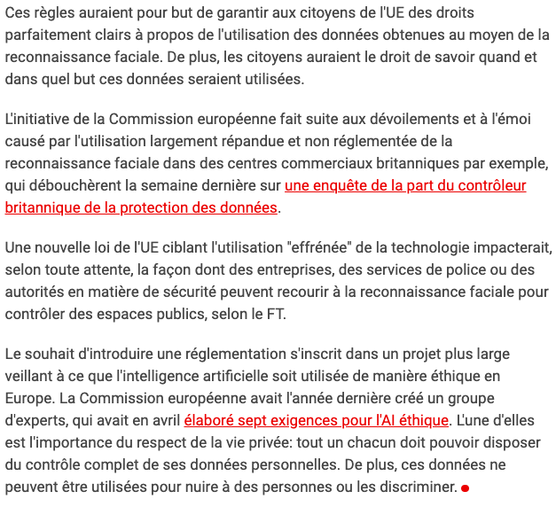

##### [Retour à l'acceuil](index.md) 

# La législation atour de la reconnaissance faciale 

|THALES. "Reconnaissance faciale : 7 tendances à suivre pour 2020"[en ligne].In *THALES*. [s. d.][consulté le 13 juin 2020]. Disponible sur le Web: <https://www.thalesgroup.com/fr/europe/france/dis/gouvernement/biometrie/reconnaissance-faciale> |

| NUFFEL, Pieter Van. "L’Europe veut introduire des règles strictes en matière de reconnaissance faciale"[en ligne]. In *DataNews* 22 août 2019. [consulté le 2 juin 2020]. Disponible sur le Web : <https://datanews.levif.be/ict/actualite/l-europe-veut-introduire-des-regles-strictes-en-matiere-de-reconnaissance-faciale/article-news-1180207.html> |
