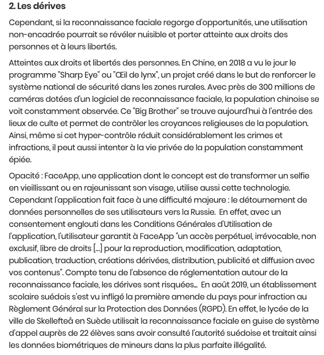
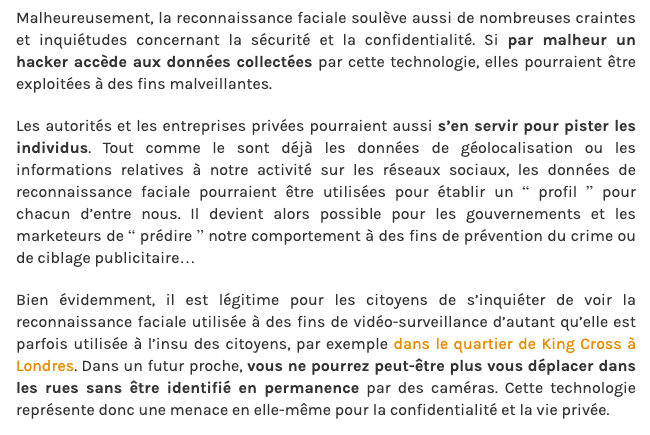
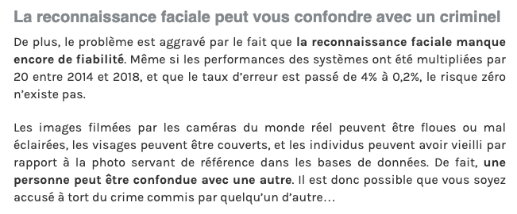
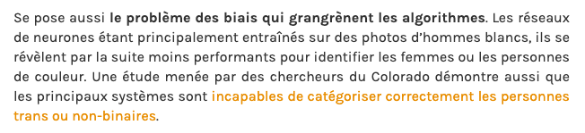
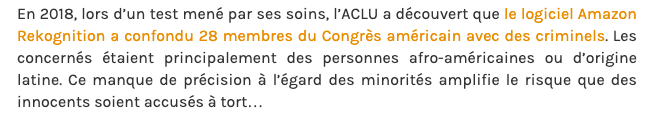
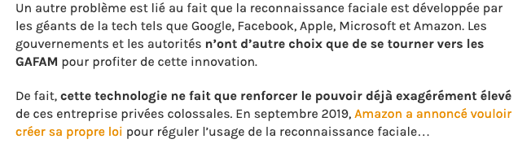

##### [Retour à l'acceuil](index.md) 

# Les risques et désavantages que comporte cette technologie 

| JACOB, Julie. "La reconnaissance faciale : entre hypersécurité et hyper intrusion" [en ligne]. In *JDN* Mise à jour le 20 octobre 2019. [Consulté le 10 juin 2020]. Disponible sur le web : <https://www.journaldunet.com/solutions/dsi/1445564-la-reconnaissance-faciale-entre-hypersecurite-et-hyper-intrusion/> |

| L, Bastien. "Reconnaissance faciale : qu’est-ce que c’est et quels sont les dangers ?" [en ligne] In *LeBigData*. 23 octobre 2019. [Consulté le 06 juin 2020]. Disponible sur le Web : <https://www.lebigdata.fr/reconnaissance-faciale-tout-savoir> |
