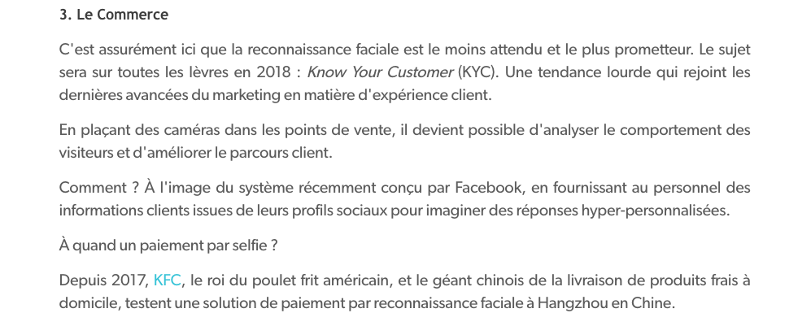

##### [Retour à l'acceuil](index.md) 

# Comment est utilisé la reconnaissance faciale? 

| THALES. "Reconnaissance faciale : 7 tendances à suivre pour 2020"[en ligne].In *THALES*. [s. d.][consulté le 13 juin 2020]. Disponible sur le Web: <https://www.thalesgroup.com/fr/europe/france/dis/gouvernement/biometrie/reconnaissance-faciale> |

|FOURNIER, Geneviève. "La CNIL ouvre le débat sur l’utilisation de la reconnaissance faciale en France"[en ligne]. In *Siècle Digital*. 21 novembre 2019. [consulté le 8 juin 2020]. Disponible à l’adresse : <https://siecledigital.fr/2019/11/21/la-cnil-ouvre-le-debat-sur-lutilisation-de-la-reconnaissance-faciale-en-france/> |

|"Reconnaissance Faciale - Glossaire Netatmo"[en ligne]. In *Netatmo*. [s. d.] [consulté le 3 juin 2020]. Disponible sur le Web : <https://www.netatmo.com/fr-fr/glossaire/reconnaissance-faciale> |
